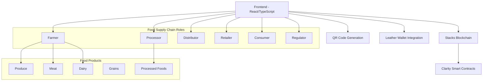

# Food Supply Chain - Blockchain-Powered Traceability Platform

TEAM NAME : BUG BUSTERS
MADHAN D
DINESHLINGAM M U


A modern, full-stack food supply chain tracking platform leveraging Stacks blockchain for transparent, decentralized food provenance from farm to table.

[](https://opensource.org/licenses/MIT)
[](https://www.typescriptlang.org/)
[](https://reactjs.org/)
[](https://stacks.co/)
[](https://clarity-lang.org/)
[](https://leather.io/)

## 🌟 Features

- **🌱 Farm to Table Tracking**: Trace food products from origin to consumer using Stacks blockchain
- **👥 Role-Based Access**: Dedicated interfaces for Farmers, Processors, Distributors, Retailers, and Consumers
- **📱 QR Code Integration**: Generate and scan QR codes for food batches and products
- **💼 Leather Wallet Support**: Connect with Leather wallet for Stacks blockchain interactions
- **📊 Real-time Monitoring**: Track food movement through the entire supply chain
- **🔒 Immutable Records**: Tamper-proof blockchain records ensure food safety and authenticity
- **📱 Responsive Design**: Works seamlessly on desktop and mobile devices

## 🏗️ Architecture Overview



## 📁 Project Structure

```
food-supply-chain/
│
├── src/
│   ├── components/         # Reusable UI components
│   │   ├── ui/            # Basic UI components (Button, Card, etc.)
│   │   ├── wallet/        # Wallet connection components
│   │   ├── supply-chain/  # Supply chain specific components
│   │   └── food/          # Food-specific components (QR, certifications)
│   ├── config/            # Environment variable loader
│   ├── hooks/             # Custom React hooks
│   │   ├── useFoodChain.ts
│   │   └── useWallet.ts
│   ├── lib/               # Utility functions
│   ├── pages/             # Main app pages
│   │   ├── Home.tsx
│   │   ├── Dashboard.tsx
│   │   ├── Traceability.tsx
│   │   ├── QRTools.tsx
│   │   └── Certifications.tsx
│   ├── types/             # TypeScript type definitions
│   ├── utils/             # Blockchain and contract integration
│   │   ├── stacks.ts
│   │   └── contracts.ts
│   ├── App.tsx            # App root component
│   └── main.tsx           # Entry point
│
├── supply-chain/
│   ├── contracts/          # Clarity smart contracts
│   │   └── supply-chain.clar  # Main food supply chain contract
│   ├── deployments/        # Clarinet deployment plans
│   ├── settings/           # Clarinet network configs
│   ├── tests/              # Clarity contract tests
│   └── Clarinet.toml       # Clarinet project config
│
├── public/                 # Static assets
├── .env.example           # Environment variables template
├── package.json           # Project dependencies
├── vite.config.ts         # Vite configuration
├── tsconfig.json          # TypeScript configuration
└── README.md              # This file
```

## 🚀 Quick Start

### Prerequisites

- Node.js 16+ 
- npm or yarn
- Git
- Leather Wallet (for Stacks)

### Installation

1. **Clone the repository**
   ```bash
   git clone https://github.com/your-username/food-supply-chain.git
   cd food-supply-chain
   ```

2. **Install dependencies**
   ```bash
   npm install
   ```

3. **Set up environment variables**
   ```bash
   cp .env.example .env
   ```
   Edit `.env` with your configuration:
   ```env
   VITE_REACT_APP_STACKS_API=https://api.testnet.hiro.so
   VITE_REACT_APP_STACKS_NETWORK=testnet
   VITE_REACT_APP_CONTRACT_ADDRESS=STW42W7AEKZ2EFYH834C6DW9272JHT1PHM92FY88
   VITE_REACT_APP_CONTRACT_NAME=supply-chain
   ```

4. **Start the development server**
   ```bash
   npm run dev
   ```
   Visit [http://localhost:8080](http://localhost:8080) in your browser.

### Smart Contract Development

1. **Navigate to the contract directory**
   ```bash
   cd supply-chain
   ```

2. **Check contract syntax**
   ```bash
   clarinet check
   ```

3. **Run tests**
   ```bash
   clarinet test
   ```

4. **Deploy to testnet**
   ```bash
   clarinet deploy --testnet
   ```

## 🧩 Core Components

### Smart Contract Functions

The main Clarity contract (`supply-chain.clar`) includes these key functions:

- `create-batch` - Create a new food product batch
- `update-location` - Update batch location in the supply chain
- `transfer-ownership` - Transfer batch to next stakeholder
- `get-batch-details` - Retrieve batch information
- `add-regulator` - Authorize food safety regulators
- `verify-authenticity` - Verify food product authenticity

### Frontend Integration

```typescript
// Example usage of food supply chain hooks
const { batches, createBatch, updateLocation } = useFoodChain();

// Create a new food batch
const handleCreateBatch = async (foodDetails) => {
  await createBatch({
    productName: foodDetails.name,
    origin: foodDetails.origin,
    initialLocation: foodDetails.location,
    harvestDate: foodDetails.harvestDate,
    expirationDate: foodDetails.expirationDate,
    metadata: JSON.stringify(foodDetails)
  });
};
```

## 🎨 UI Components

The application uses a modern component library with:

- **Tailwind CSS** for styling
- **Lucide Icons** for consistent iconography
- **Custom Design System** with responsive components
- **QR Code Scanner/Generator** for food product tracking

## 🔗 Blockchain Integration

### Stacks Blockchain
- Interact with Clarity contracts using `@stacks/connect`
- Leather wallet integration for authentication
- Contract Name - supply-chain
- Testnet support with your contract address: `STW42W7AEKZ2EFYH834C6DW9272JHT1PHM92FY88.supply-chain'
## 📱 Usage Guide

### For Farmers
1. Connect your Leather wallet
2. Create a new food product batch
3. Generate QR codes for your products
4. Record initial product information including harvest dates

### For Distributors
1. Scan food product QR codes
2. Update location and temperature information
3. Confirm transfers between locations

### For Retailers
1. Receive products and verify authenticity
2. Update product status to "on shelves"
3. Provide consumers with provenance information

### For Consumers
1. Scan QR codes to view food history
2. Verify food authenticity and origin
3. Access detailed supply chain information

### For Regulators
1. Monitor food safety compliance
2. Access audit trails
3. Verify regulatory requirements are met

## 🧪 Testing

### Frontend Tests
```bash
npm run test
```

### Contract Tests
```bash
cd supply-chain
clarinet test
```

## 🚢 Deployment

### Frontend Deployment (Vercel/Netlify)
```bash
npm run build
```

### Contract Deployment
```bash
# Testnet
clarinet deploy --testnet
```

## 🤝 Contributing

We welcome contributions! Please see our [Contributing Guidelines](CONTRIBUTING.md) for details.

1. Fork the repository
2. Create a feature branch: `git checkout -b feature/amazing-feature`
3. Commit your changes: `git commit -m 'Add amazing feature'`
4. Push to the branch: `git push origin feature/amazing-feature`
5. Open a pull request

## 📄 License

This project is licensed under the MIT License - see the [LICENSE](LICENSE) file for details.

## 🙏 Acknowledgments

- [Stacks Foundation](https://stacks.org/) for blockchain infrastructure
- [Leather Wallet](https://leather.io/) for wallet integration
- [Clarity Language](https://clarity-lang.org/) for smart contract development
- [Vite](https://vitejs.dev/) for fast build tooling
- [Tailwind CSS](https://tailwindcss.com/) for styling utilities

## 📞 Contant

If you have any questions or need help, please:

1. Check the [documentation](https://github.com/your-username/food-supply-chain/wiki)
2. Open an [issue](https://github.com/your-username/food-supply-chain/issues)
3. Join our [community forum](https://discord.gg/your-invite-link)
4.Intagram 


## 🔮 Roadmap

- [ ] Mobile app development
- [ ] IoT integration for temperature monitoring
- [ ] Advanced analytics dashboard
- [ ] Sustainability impact reporting
- [ ] API for third-party integrations
- [ ] Multi-language support

---

**Built with ❤️ for transparent food supply chains worldwide.**


---

<div align="center">
  
[](https://stacks.co/)
[](https://clarity-lang.org/)
[](https://reactjs.org/)
[](https://www.typescriptlang.org/)
[](https://vitejs.dev/)
[](https://tailwindcss.com/)
[](https://leather.io/)

</div>
